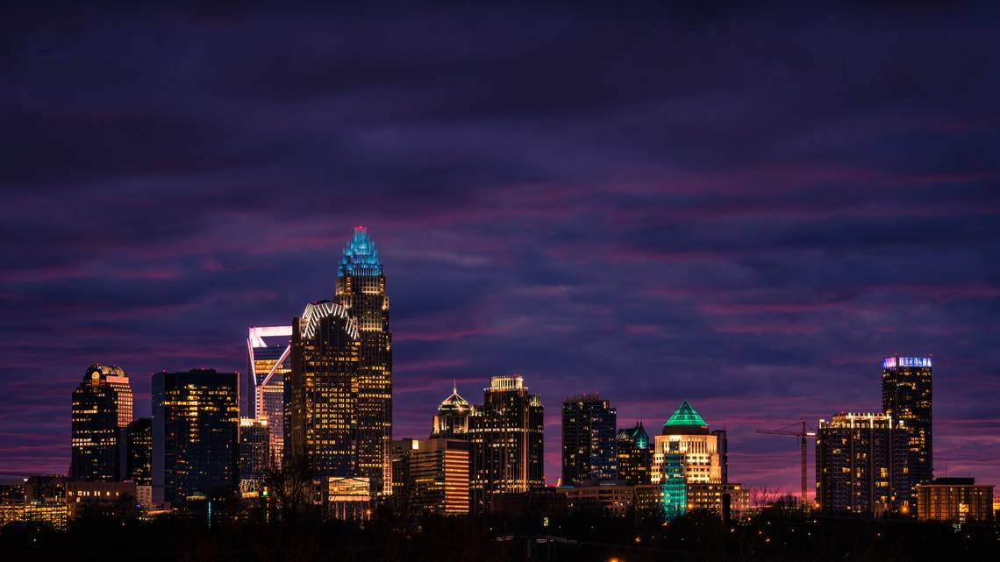

# 01 Project - Charlotte's Sights and Lights

# Description: a coded-from-scratch project that intends to showcase the group's proficiency and mastery over the content that has been taught over the past two months. We decided to go with the form of a travel guide to the city of Charlotte that gives a brief overview of our lovely Queen City and showcases some good places to eat and fun things to do.

# Deployment Link: https://github.com/Kallandan/01P-Charlotte_Sights_And_Lights

# Website Link: https://kallandan.github.io/01P-Charlotte_Sights_And_Lights